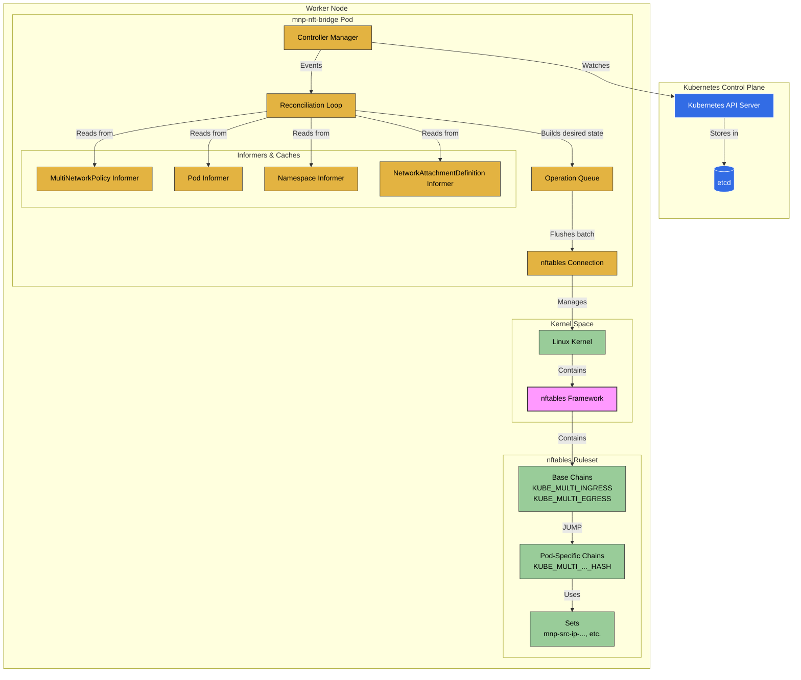

# mnp-nft-bridge: A Kubernetes MultiNetworkPolicy Controller for nftables

[](https://opensource.org/licenses/Apache-2.0)
[](https://goreportcard.com/report/github.com/feitnomore/mnp-nft-bridge)
[](https://pkg.go.dev/github.com/feitnomore/mnp-nft-bridge)
[](#)
[](#)
[](https://github.com/feitnomore/mnp-nft-bridge/releases)

```text
                                     __ _          _          _     _
                                    / _| |        | |        (_)   | |
  _ __ ___  _ __  _ __ ______ _ __ | |_| |_ ______| |__  _ __ _  __| | __ _  ___
 | '_ ` _ \| '_ \| '_ \______| '_ \|  _| __|______| '_ \| '__| |/ _` |/ _` |/ _ \
 | | | | | | | | | |_) |     | | | | | | |_       | |_) | |  | | (_| | (_| |  __/
 |_| |_| |_|_| |_| .__/      |_| |_|_|  \__|      |_.__/|_|  |_|\__,_|\__, |\___|
                 | |                                                   __/ |
                 |_|                                                  |___/
```

## Architecture

The mnp-nft-bridge runs as a `DaemonSet` on each node in the Kubernetes cluster. Its core logic is built around the Kubernetes controller pattern.

1.  **Controllers & Informers:** The main process initializes several controllers that watch for changes to key Kubernetes resources. Informers provide an efficient, cache-based mechanism to react to these events.
    -   `MultiNetworkPolicyController`: Watches for MNP creation, updates, and deletions.
    -   `PodController`: Watches for pods, paying close attention to their labels and network status annotations.
    -   `NamespaceController`: Watches for namespace label changes, which can affect `namespaceSelector` rules in policies.
    -   `NetworkAttachmentDefinitionController`: Watches for network definitions to identify which networks are of the `bridge` type and thus managed by this controller.

2.  **Reconciliation Loop:** Events from the informers trigger a central reconciliation loop. This loop is debounced to batch multiple quick changes into a single run. A periodic reconciliation also runs to ensure the state is consistent.

3.  **`nftables` Interaction:**
    *   The desired state is translated into a series of `nftables` operations (add/delete chains, sets, and rules).
    *   These operations are queued and then flushed to the kernel in an atomic batch transaction.
    *   The controller creates a `filter` table in the `bridge` family and establishes base `KUBE_MULTI_INGRESS` and `KUBE_MULTI_EGRESS` chains.
    *   For each pod selected by a policy, a dedicated chain is created. Traffic is directed to these pod-specific chains via `JUMP` rules in the base chains, matched by the pod's MAC address.
    *   A `DROP` rule is placed after the `JUMP` rule for each managed pod, ensuring a \"default deny\" posture for any traffic not explicitly allowed by the policy.



### Intra-Node Traffic
For any two pods running on the **same node** and attached to the same secondary bridge network, policies are always enforced correctly.
  
### Inter-Node Traffic (Across Different Nodes)  
Policy enforcement for traffic between pods on **different nodes** depends on your underlying node network topology. mnp-nft-bridge operates at Layer 2, inspecting the source and destination MAC addresses of traffic passing through the CNI bridge.

For inter-node policies to work, the CNI bridges (br0 in the examples) on all relevant nodes must be part of the **same Layer 2 broadcast domain**. This is typically achieved by:

1. Creating a Linux bridge on each node.
2. Attaching a dedicated physical network interface (e.g., eth1) from each node to its local bridge.
3. Connecting these physical interfaces to the same switch or VLAN.  
  
In this configuration, pod-to-pod traffic between nodes is forwarded at Layer 2, preserving the original source pod's MAC address, which allows mnp-nft-bridge to enforce the policy correctly on the destination node.

**Important:** If your nodes are using a standard routed network model (where traffic between nodes is forwarded at Layer 3), the source MAC address of inter-node packets will be rewritten to the source node's MAC address. In this common scenario, mnp-nft-bridge will not be able to enforce policies for pod-to-pod traffic that crosses node boundaries.

